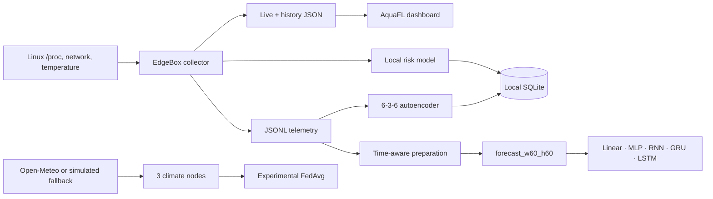

# AquaFL — distributed intelligence at the edge

> An experimental Edge AI and Federated Learning platform that turns a low-cost ARM64 TV Box into a node capable of collecting telemetry, assessing operational risk, detecting anomalies, and training forecasting models without a GPU.

[Versão em português](README.md)

## Overview

AquaFL explores a practical question: **how much intelligence can run close to the data on affordable hardware?**

The project keeps an EdgeBox node operating continuously and combines four complementary flows:

1. **Operational observability** — CPU, RAM, temperature, disk, latency, load, and network telemetry.
2. **Node risk** — a lightweight local model estimates an operational index between `0` and `1`.
3. **Anomaly detection** — a NumPy `6 → 3 → 6` autoencoder detects deviations from learned behavior.
4. **Supervised forecasting** — five CPU-only PyTorch topologies predict all six metrics exactly ten minutes ahead.

The repository also includes a climate demonstration with three local nodes and simplified **FedAvg** aggregation. It represents AquaFL's federated direction; it is not yet a production distributed deployment.

## Architecture



### What each signal means

- **Operational risk** asks: “how much pressure is the node under across multiple metrics?”
- **Anomaly score** asks: “does this sample differ from the behavior learned by the autoencoder?”
- **Forecasting** asks: “what will the six metrics look like ten minutes from now?”

An anomaly is not necessarily a failure. A legitimate training workload may differ from the normal pattern and trigger `ATTENTION`.

## Reference EdgeBox

Real tests ran on a TV Box with:

| Component | Validated environment |
|---|---|
| CPU | ARM64, 4 threads |
| RAM | approximately 1.86 GB |
| Python | 3.13.5 |
| NumPy | 2.5.3 |
| PyTorch | 2.14.0+cpu |
| Acceleration | CPU only; CUDA is not used |
| Operational sampling | approximately 10 seconds |

The collector reads native Linux interfaces such as `/proc`, `/sys`, `ping`, and network counters. The forecasting pipeline also supports Windows for development and testing.

## Operational metrics

All EdgeBox ML flows share six features in this exact order:

```text
cpu_percent
ram_percent
temperature_c
disk_percent
latency_ms
load1
```

The node also captures uptime, RX/TX traffic, addresses, and additional load averages for the dashboard.

## Risk and autoencoder

### Node risk

The EdgeBox produces a weighted heuristic target, trains a lightweight local regression over recent history, and infers `inferred_risk`:

| Range | State |
|---:|---|
| `< 0.35` | STABLE |
| `0.35 – 0.54` | ATTENTION |
| `0.55 – 0.74` | ALERT |
| `≥ 0.75` | CRITICAL |

### Autoencoder

The lightweight autoencoder uses NumPy and a `6 → 3 → 6` architecture. Its threshold is learned from training reconstruction errors. Classification uses `error / threshold`:

| Anomaly score | State |
|---:|---|
| `< 0.7` | NORMAL |
| `0.7 – 0.99` | ATTENTION |
| `1.0 – 1.49` | ANOMALY |
| `≥ 1.5` | CRITICAL ANOMALY |

On the reference TV Box, the model was trained with 1,200 samples. During a GRU training run, it recorded scores between `0.70` and `0.94`, then returned to `NORMAL` after the workload ended. This demonstrates behavioral change detection, not failure probability.

## Forecasting

The current dataset uses:

```text
60 samples × 10 seconds = previous 10 minutes
                        ↓
point forecast of all 6 metrics exactly +10 minutes
```

Contract:

```text
X = (N, 60, 6)
y = (N, 6)
dataset = dados/edgebox/processed/forecast_w60_h60/
```

Preparation applies a chronological split, train-derived imputation, outlier handling, and normalization without leaking future split statistics into training.

### Comparable topologies

| Model | Architecture | Parameters |
|---|---|---:|
| Linear | Flatten 360 → 6 | 2,166 |
| MLP | 360 → 64 → 32 → 6, ReLU | 25,382 |
| RNN | RNN(6, 32, 1) → 6 | 1,478 |
| GRU | GRU(6, 32, 1) → 6 | 4,038 |
| LSTM | LSTM(6, 32, 1) → 6 | 5,318 |

Shared defaults: Adam, MSELoss, 25 epochs, batch size 32, learning rate `0.001`, and seed `42`.

## TV Box execution results

All five models completed forward, backward, serialization, smoke tests, and a real 25-epoch training run on the ARM64 CPU. The dataset contains 1,280/181/181 train/validation/test samples.

### Compute cost

| Model | Parameters | Time — 25 epochs | Cost relative to Linear |
|---|---:|---:|---:|
| Linear | 2,166 | **9.85 s** | 1.0× |
| MLP | 25,382 | 19.06 s | 1.9× |
| RNN | **1,478** | 137.33 s | 13.9× |
| GRU | 4,038 | 320.40 s | 32.5× |
| LSTM | 5,318 | 283.51 s | 28.8× |

The five training runs took approximately **12 min 50 s** in total. Recurrent operations traverse the 60 steps sequentially and are much slower than the vectorized MLP on the ARM64 CPU despite having fewer parameters.

### Observed predictive quality

| Model | Best epoch | Best Val MSE | Final Val MSE | Final Test MSE | Final Test MAE | Final Test RMSE |
|---|---:|---:|---:|---:|---:|---:|
| Linear | 3 | 0.529610 | 0.575716 | 0.577291 | **0.450146** | 0.759797 |
| MLP | 1 | 0.521118 | 1.077203 | 1.196583 | 0.675434 | 1.093884 |
| RNN | 7 | **0.455175** | 0.487247 | 0.548866 | 0.460153 | 0.740855 |
| GRU | 7 | 0.461654 | 0.514545 | **0.489516** | 0.451221 | **0.699654** |
| LSTM | 3 | 0.464945 | 0.626673 | 0.506401 | 0.454064 | 0.711619 |

Errors are reported in normalized space. Test metrics correspond to the final epoch-25 checkpoint; the current routine does not restore the best epoch yet. This table therefore demonstrates **computational feasibility and training behavior**, not definitive model selection.

The MLP overfit strongly after its first epoch. Linear and LSTM reached their best validation values at epoch 3; RNN and GRU did so at epoch 7. Early stopping and best-checkpoint restoration are on the roadmap.

## Installation

```bash
git clone https://github.com/fkumagae/aqua-fl.git
cd aqua-fl
python3 -m venv .venv-benchmark
source .venv-benchmark/bin/activate
python -m pip install --upgrade pip
pip install torch==2.14.0 --index-url https://download.pytorch.org/whl/cpu
pip install -r requirements-benchmark.txt
```

On Windows, activate with `.venv-benchmark\Scripts\activate` and install the appropriate PyTorch wheel.

## Quick start

Create runtime directories:

```bash
mkdir -p logs banco dados/edgebox web
```

Collect one sample and update risk/dashboard output:

```bash
python -m fluxos.edgebox.edgebox_node
```

After collecting at least 20 samples, train and test the autoencoder:

```bash
python -m fluxos.edgebox.edgebox_autoencoder train
python -m fluxos.edgebox.edgebox_autoencoder infer
```

Run Linux loops in separate terminals. The environment variable selects a virtualenv without editing scripts:

```bash
export AQUAFL_PYTHON="$PWD/.venv-benchmark/bin/python"
bash scripts/edgebox_loop.sh
```

```bash
export AQUAFL_PYTHON="$PWD/.venv-benchmark/bin/python"
bash scripts/edgebox_autoencoder_loop.sh
```

Serve the dashboard from the project root:

```bash
python -m http.server 8080
```

Open `http://EDGEBOX_IP:8080/web/index.html`. The runtime-generated technical page is available at `/web/legacy.html`.

## Forecast dataset and training

The operational history at `dados/edgebox/edgebox_metrics.jsonl` must exist before preparation:

```bash
python -m fluxos.edgebox.benchmark.prepare_dataset \
  --window 60 \
  --horizon 60
```

Train one topology:

```bash
python -m fluxos.edgebox.models.gru \
  --epochs 25 \
  --batch-size 32 \
  --learning-rate 0.001
```

By default, progress is printed once per epoch. Use detailed or quiet output with:

```bash
python -m fluxos.edgebox.models.gru --verbose
python -m fluxos.edgebox.models.gru --quiet
```

Artifacts are written to `dados/edgebox/models/<topology>/w60_h60/`:

```text
model.pt       PyTorch state_dict
model.json     architecture and environment
metrics.json   metrics, history, and duration
```

## Tests

```bash
python -m unittest tests.test_forecasting_models -v
```

The suite covers all five topologies, shapes, backward, CPU execution, parameter counts, `state_dict` round-trips, and temporary smoke training.

## Repository layout

```text
fluxos/
├── clima/                     federated climate demonstration
└── edgebox/
    ├── benchmark/             time-aware preparation
    ├── models/                PyTorch forecasters
    ├── edgebox_node.py        collection and operational risk
    ├── edgebox_autoencoder.py anomaly detection
    ├── edgebox_db_sync.py     SQLite persistence
    └── train_edgebox_model.py lightweight risk training
scripts/                       portable Linux loops
tests/                         CPU forecaster tests
web/                           frontend and dashboards
dados/                         small versioned models/demos
```

Raw data, processed datasets, databases, logs, experimental weights, and runtime-generated pages are excluded from Git.

## Current limitations

- Forecasting is fixed to `w60_h60`; other combinations are not CLI parameters yet.
- The saved checkpoint is the final epoch, not the best validation epoch.
- CPU, RAM, and temperature are not yet captured by a dedicated benchmark runner.
- The anomaly score is not a probability and has not been validated against labeled operational failures.
- The FedAvg demonstration is local and simplified; real federated communication is future work.
- Alerts do not yet require distinct consecutive samples.

## Roadmap

- best-validation checkpoints and early stopping;
- configurable window/horizon matrix;
- benchmark runner for CPU, RAM, temperature, and inference;
- autoencoder calibration with labeled events;
- persistence/hysteresis for alerts;
- a real, secure, and reproducible federated aggregator.

## Technical documentation

- [Benchmark proposal](BENCHMARK_PROPOSAL.md)
- [Benchmark architecture review](GPT_REVIEW_BENCHMARK.md)
- [Forecasting model guide](fluxos/edgebox/models/README.md)
