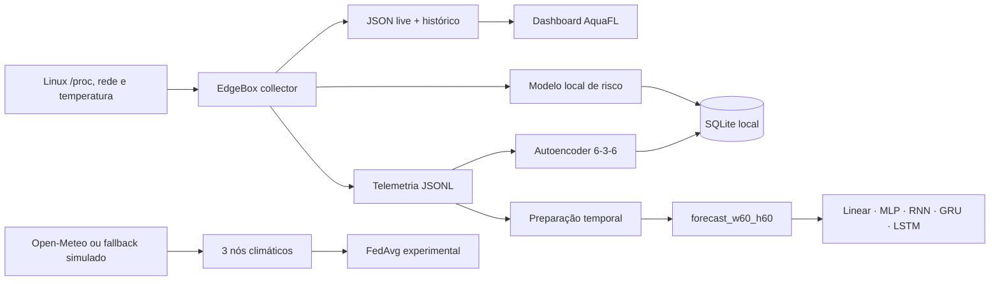

# AquaFL — inteligência distribuída na borda

> Plataforma experimental de Edge AI e Federated Learning que transforma uma TV Box ARM64 de baixo custo em um nó capaz de coletar telemetria, avaliar risco operacional, detectar anomalias e treinar modelos de forecasting sem GPU.

[English version](README.en.md)

## Visão geral

O AquaFL investiga uma pergunta prática: **quanto de inteligência pode ser executado perto dos dados usando hardware acessível?**

O projeto mantém um nó EdgeBox em operação contínua e organiza quatro fluxos complementares:

1. **Observabilidade operacional** — CPU, RAM, temperatura, disco, latência, carga e rede.
2. **Risco do nó** — um modelo local leve estima um índice operacional entre `0` e `1`.
3. **Detecção de anomalias** — um autoencoder NumPy `6 → 3 → 6` identifica desvios do comportamento aprendido.
4. **Forecasting supervisionado** — cinco topologias PyTorch CPU preveem as seis métricas exatamente dez minutos à frente.

O repositório também inclui uma demonstração climática com três nós locais e agregação **FedAvg simplificada**. Ela representa a direção federada do AquaFL; ainda não é uma implantação distribuída de produção.

## Arquitetura



### O que cada sinal significa

- **Risco operacional** responde: “qual é o nível de pressão sobre o nó considerando várias métricas?”.
- **Anomaly score** responde: “esta amostra está diferente do padrão aprendido pelo autoencoder?”.
- **Forecasting** responde: “quais serão as seis métricas daqui a dez minutos?”.

Anomalia não é sinônimo de falha. Uma carga legítima de treinamento, por exemplo, pode ser diferente do padrão normal e gerar `ATENÇÃO`.

## EdgeBox de referência

Os testes reais foram executados em uma TV Box com:

| Componente | Ambiente validado |
|---|---|
| CPU | ARM64, 4 threads |
| RAM | aproximadamente 1,86 GB |
| Python | 3.13.5 |
| NumPy | 2.5.3 |
| PyTorch | 2.14.0+cpu |
| Aceleração | CPU only; CUDA não é usada |
| Amostragem operacional | aproximadamente 10 segundos |

O ambiente-alvo é a TV Box ARM64 com Linux. O coletor usa interfaces nativas do sistema como `/proc`, `/sys`, `ping` e contadores de rede.

## Métricas operacionais

Os fluxos EdgeBox compartilham seis features, sempre nesta ordem:

```text
cpu_percent
ram_percent
temperature_c
disk_percent
latency_ms
load1
```

O nó também registra uptime, tráfego RX/TX, endereços de rede e médias de carga adicionais para o dashboard.

## Risco e autoencoder

### Risco do nó

O EdgeBox cria um alvo heurístico ponderado, treina localmente uma regressão leve sobre o histórico recente e infere `inferred_risk`:

| Faixa | Estado |
|---:|---|
| `< 0.35` | ESTÁVEL |
| `0.35 – 0.54` | ATENÇÃO |
| `0.55 – 0.74` | ALERTA |
| `≥ 0.75` | CRÍTICO |

### Autoencoder

O autoencoder leve usa NumPy e arquitetura `6 → 3 → 6`. O threshold é aprendido a partir dos erros de reconstrução do treino. A classificação usa a razão `erro / threshold`:

| Anomaly score | Estado |
|---:|---|
| `< 0.7` | NORMAL |
| `0.7 – 0.99` | ATENÇÃO |
| `1.0 – 1.49` | ANOMALIA |
| `≥ 1.5` | ANOMALIA CRÍTICA |

Na TV Box de referência, o modelo foi treinado com 1.200 amostras. Durante um treino de GRU, o autoencoder registrou scores entre `0.70` e `0.94` e retornou a `NORMAL` após o fim da carga — evidência de que o loop detecta mudanças operacionais, não uma medida de probabilidade de falha.

## Forecasting

O dataset atual usa:

```text
60 amostras × 10 segundos = últimos 10 minutos
                         ↓
previsão pontual das 6 métricas exatamente +10 minutos
```

Contrato:

```text
X = (N, 60, 6)
y = (N, 6)
dataset = dados/edgebox/processed/forecast_w60_h60/
```

O preparador faz split temporal, imputação baseada no treino, tratamento de outliers e normalização sem misturar informações futuras nos parâmetros do treino.

### Topologias comparáveis

| Modelo | Arquitetura | Parâmetros |
|---|---|---:|
| Linear | Flatten 360 → 6 | 2.166 |
| MLP | 360 → 64 → 32 → 6, ReLU | 25.382 |
| RNN | RNN(6, 32, 1) → 6 | 1.478 |
| GRU | GRU(6, 32, 1) → 6 | 4.038 |
| LSTM | LSTM(6, 32, 1) → 6 | 5.318 |

Defaults compartilhados: Adam, MSELoss, 25 épocas, batch 32, learning rate `0.001` e seed `42`.

## Resultado de execução na TV Box

Todos os cinco modelos completaram forward, backward, serialização, smoke test e um treino real de 25 épocas em CPU ARM64. O dataset contém 1.280/181/181 amostras de treino/validação/teste.

### Custo computacional

| Modelo | Parâmetros | Tempo — 25 épocas | Custo relativo ao Linear |
|---|---:|---:|---:|
| Linear | 2.166 | **9,85 s** | 1,0× |
| MLP | 25.382 | 19,06 s | 1,9× |
| RNN | **1.478** | 137,33 s | 13,9× |
| GRU | 4.038 | 320,40 s | 32,5× |
| LSTM | 5.318 | 283,51 s | 28,8× |

Os cinco treinos levaram aproximadamente **12 min 50 s** no total. Operações recorrentes percorrem os 60 passos sequencialmente e, apesar de terem poucos parâmetros, são muito mais lentas que a MLP vetorizada na CPU ARM64.

### Qualidade preditiva observada

| Modelo | Melhor época | Melhor Val MSE | Val MSE final | Test MSE final | Test MAE final | Test RMSE final |
|---|---:|---:|---:|---:|---:|---:|
| Linear | 3 | 0,529610 | 0,575716 | 0,577291 | **0,450146** | 0,759797 |
| MLP | 1 | 0,521118 | 1,077203 | 1,196583 | 0,675434 | 1,093884 |
| RNN | 7 | **0,455175** | 0,487247 | 0,548866 | 0,460153 | 0,740855 |
| GRU | 7 | 0,461654 | 0,514545 | **0,489516** | 0,451221 | **0,699654** |
| LSTM | 3 | 0,464945 | 0,626673 | 0,506401 | 0,454064 | 0,711619 |

Os erros estão na escala normalizada. As métricas de teste correspondem ao checkpoint final da época 25; a rotina atual ainda não restaura a melhor época. Portanto, esta tabela demonstra principalmente **viabilidade computacional e comportamento de treino**, não uma seleção definitiva do melhor modelo.

A MLP apresentou sobreajuste forte após a primeira época. Linear e LSTM tiveram seus melhores valores na época 3; RNN e GRU, na época 7. Early stopping e restauração do melhor checkpoint estão no roadmap.

## Instalação

```bash
git clone https://github.com/fkumagae/aqua-fl.git
cd aqua-fl
python3 -m venv .venv-benchmark
source .venv-benchmark/bin/activate
python -m pip install --upgrade pip
pip install torch==2.14.0 --index-url https://download.pytorch.org/whl/cpu
pip install -r requirements-benchmark.txt
```

## Execução rápida

Crie os diretórios de runtime:

```bash
mkdir -p logs banco dados/edgebox web
```

Colete uma amostra e atualize risco/dashboard:

```bash
python -m fluxos.edgebox.edgebox_node
```

Após pelo menos 20 amostras, treine e teste o autoencoder:

```bash
python -m fluxos.edgebox.edgebox_autoencoder train
python -m fluxos.edgebox.edgebox_autoencoder infer
```

Para executar os loops no Linux, use terminais separados. A variável permite escolher a virtualenv sem editar os scripts:

```bash
export AQUAFL_PYTHON="$PWD/.venv-benchmark/bin/python"
bash scripts/edgebox_loop.sh
```

```bash
export AQUAFL_PYTHON="$PWD/.venv-benchmark/bin/python"
bash scripts/edgebox_autoencoder_loop.sh
```

Sirva o dashboard a partir da raiz do projeto:

```bash
python -m http.server 8080
```

Acesse `http://IP_DA_EDGEBOX:8080/web/index.html`. A página técnica gerada em runtime fica em `/web/legacy.html`.

## Preparação e treino de forecasting

O histórico operacional `dados/edgebox/edgebox_metrics.jsonl` deve existir antes da preparação:

```bash
python -m fluxos.edgebox.benchmark.prepare_dataset \
  --window 60 \
  --horizon 60
```

Treine uma topologia:

```bash
python -m fluxos.edgebox.models.gru \
  --epochs 25 \
  --batch-size 32 \
  --learning-rate 0.001
```

O padrão mostra um resumo por época. Para acompanhamento detalhado ou execução silenciosa:

```bash
python -m fluxos.edgebox.models.gru --verbose
python -m fluxos.edgebox.models.gru --quiet
```

Os artefatos ficam em `dados/edgebox/models/<topologia>/w60_h60/`:

```text
model.pt       state_dict do PyTorch
model.json     arquitetura e ambiente
metrics.json   métricas, histórico e duração
```

Para comparar um horizonte de **5 minutos** mantendo a mesma janela de entrada de **10 minutos**, crie um segundo dataset e selecione `--horizon 30` no treino:

```bash
python -m fluxos.edgebox.benchmark.prepare_dataset --window 60 --horizon 30
python -m fluxos.edgebox.models.gru --horizon 30 --epochs 25 --batch-size 32 --learning-rate 0.001
```

Repita o segundo comando para `linear`, `mlp`, `rnn` e `lstm`. Os novos resultados ficam em `dados/edgebox/models/<topologia>/w60_h30/`, sem sobrescrever `w60_h60`. As métricas de 25 épocas apresentadas acima são apenas de `w60_h60`; ainda não há resultados reais de `w60_h30`.

## Testes

```bash
python -m unittest tests.test_forecasting_models -v
```

A suíte cobre as cinco topologias, shapes, backward, CPU, contagem de parâmetros, round-trip de `state_dict` e smoke training temporário nos horizontes 30 e 60.

## Estrutura do repositório

```text
fluxos/
├── clima/                     demonstração federada climática
└── edgebox/
    ├── benchmark/             preparação temporal
    ├── models/                forecasters PyTorch
    ├── edgebox_node.py        coleta e risco operacional
    ├── edgebox_autoencoder.py detecção de anomalias
    ├── edgebox_db_sync.py     persistência SQLite
    └── train_edgebox_model.py treino leve do risco
scripts/                       loops Linux portáveis
tests/                         testes CPU dos forecasters
web/                           frontend e dashboards
dados/                         pequenos modelos/demonstrações versionados
```

Dados brutos, datasets processados, bancos, logs, pesos experimentais e páginas geradas em runtime são ignorados pelo Git.

## Limitações atuais

- O forecasting está fixo em `w60_h60`; outras combinações ainda não são parâmetros da CLI.
- O checkpoint salvo é o da última época, não o de melhor validação.
- CPU, RAM e temperatura ainda não são coletadas por um benchmark runner dedicado.
- O anomaly score não é uma probabilidade nem possui acurácia operacional validada com rótulos reais.
- A demonstração FedAvg é local e simplificada; comunicação federada real é trabalho futuro.
- Alertas ainda não exigem amostras distintas e consecutivas.

## Próximos passos

- checkpoint de melhor validação e early stopping;
- matriz configurável de janela/horizonte;
- benchmark runner para CPU, RAM, temperatura e inferência;
- calibração do autoencoder com eventos rotulados;
- persistência/histerese para alertas;
- agregador federado real, seguro e reproduzível.

## Documentação técnica

- [Proposta de benchmarking](BENCHMARK_PROPOSAL.md)
- [Revisão da arquitetura de benchmark](GPT_REVIEW_BENCHMARK.md)
- [Guia dos modelos de forecasting](fluxos/edgebox/models/README.md)
